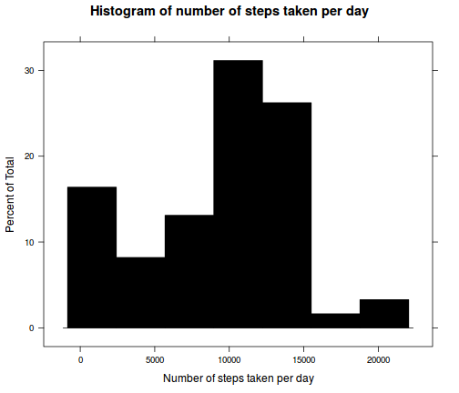
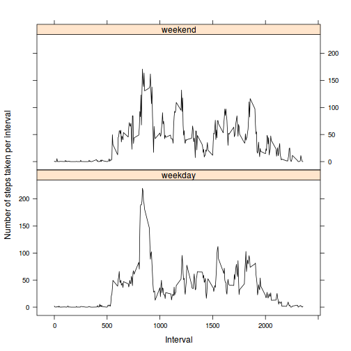

# Activity monitoring data
========================================================

## Load and preprocess the data

First, we load the data, and preprocessing is not made because it is not necessary. The graphics will be made by the use of the lattice package.


```r
library(lattice)
data <- read.csv("activity.csv")
```


## Number of steps taken per day

In this section, we will analyze the variable number of steps taken per day, taken from an activity monitoring device. FIrstly, we compute the total number of steps taken per day and a histogram is plotted.

```r
steps.per.day <- tapply(data$steps, data$date, sum, na.rm = T)
histogram(steps.per.day, col = 1, xlab = "Number of steps taken per day", main = "Histogram of number of steps taken per day")
```

 


After that, we considered necessary to compute mean and median of this variable.


```r
mean.steps <- mean(steps.per.day, na.rm = T)
median.steps <- median(steps.per.day, na.rm = T)
```


The mean of number of steps taken per day is 9354.2295 and its median is 10395.

## Average daily activity pattern

In order to analyze the average daily activity pattern, it is interesting to display the number of steps taken per interval, averaged across all the days. For this, we need to compute the average of number of steps per interval, and then plot this variable against intervals.


```r
steps.per.interval <- tapply(data$steps, data$interval, mean, na.rm = T)
intervals <- unique(data$interval)
xyplot(steps.per.interval ~ intervals, type = "l", xlab = "Interval", col = 1, 
    ylab = "Number of steps per interval")
```

 


Moreover, the interval with the maximum number of steps will be computed.

```r
max.steps.interval <- max(steps.per.interval)
interval.max.steps <- names(steps.per.interval)[which.max(steps.per.interval)]
```


The interval with the maximum number of steps is 835 with a value of 206.1698.

## Missing values of number of steps

First, the number of missing values of number of steps will be calculated.

```r
number.nas <- sum(is.na(data$steps))
```


The number of missing values or NAs is 2304. Once the number of NAs are obtained, these missing values should be filled with some value. In this case, we decided to fill them with the average of number of steps of the corresponding interval. For this, a new data.frame is created and then this missing values were filled. 


```r
data.mod <- data
data.mod$steps[is.na(data.mod$steps)] <- steps.per.interval
```


A histogram of total number of steps taken per day was plotted with no missing values. Then, the mean and median were recomputed to compare with the previous results.


```r
new.steps.per.day <- tapply(data.mod$steps, data.mod$date, sum, na.rm = T)
histogram(new.steps.per.day, col = 1, xlab = "Number of steps taken per day", 
    main = "Histogram of number of steps taken per day")
```

 

```r
new.mean.steps <- mean(new.steps.per.day, na.rm = T)
new.median.steps <- median(new.steps.per.day, na.rm = T)
```


For new data with no missing values, the mean of number of steps taken per day is 1.0766 &times; 10<sup>4</sup> and its median is 1.0766 &times; 10<sup>4</sup>. These values differed from the previous values computed, and we can observe that mean and median are the same in this new case.

## Differences in activity patterns between weekdays and weekends

In order to analyze the differences in activity patterns between weekdays and weekend, it is necessary to obtain the day-number within week, to create a new variable which divides between them.

```r
weekd <- as.POSIXlt(as.Date(data.mod$date))$wday
data.mod$day <- ifelse(weekd %in% c(0, 1), "weekend", "weekday")
```


Then, we averaged the number of steps taken per interval across all the days, and a data.frame was created to create a graph to observe the activity pattern of weekdays and weekends.


```r
steps.per.interval.week <- tapply(data.mod$steps, list(data.mod$interval, data.mod$day), 
    mean, na.rm = T)
df <- data.frame(interval = rep(intervals, 2), steps = c(steps.per.interval.week[, 
    "weekday"], steps.per.interval.week[, "weekend"]), day = rep(c("weekday", 
    "weekend"), each = length(intervals)))
xyplot(steps ~ interval | day, data = df, type = "l", col = 1, layout = c(1, 
    2), xlab = "Interval", ylab = "Number of steps taken per interval")
```

 


Observing the previous figure, we can observe that there is a peak higher in weekdays, which agrees with the more work activity of these days.


